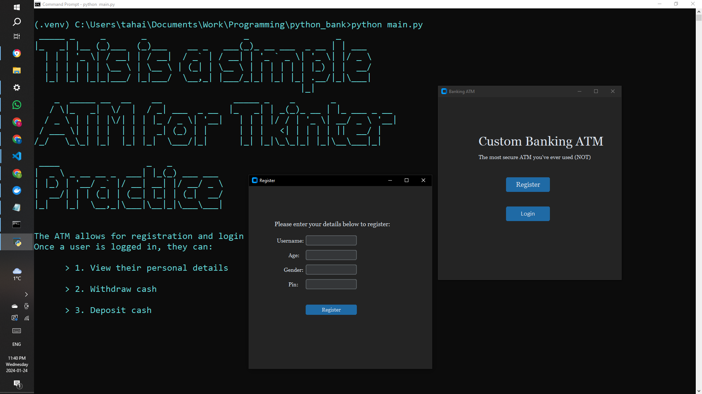
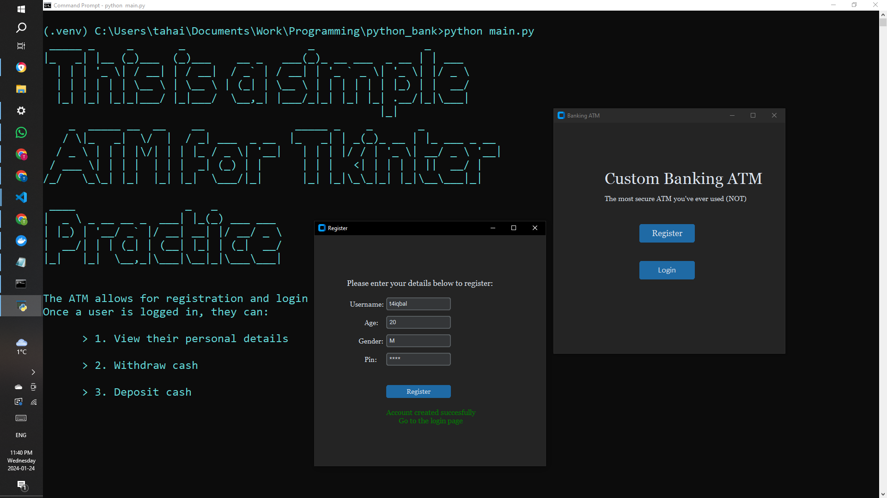
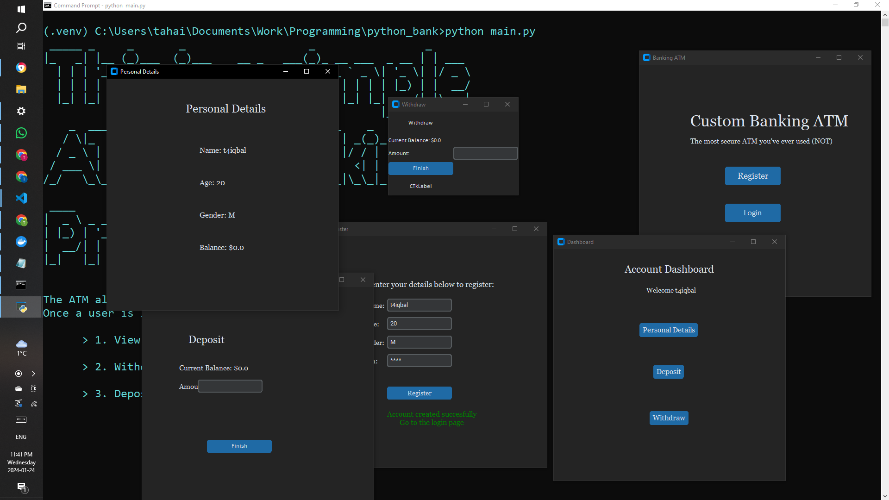

#Tkinter Practice Dockerized ATM app
Here I've bult a dockerized ATM app in python with a GUI. 
Allows users to register, login, view personal detials, deposit, withdraw.

Some cool tricks this project uses
- lambda functions
- reading and writing to files
- context managers

Use the following command to pull this docker container onto your local machine: *docker pull t4iqbal404/banking_gui_app*

